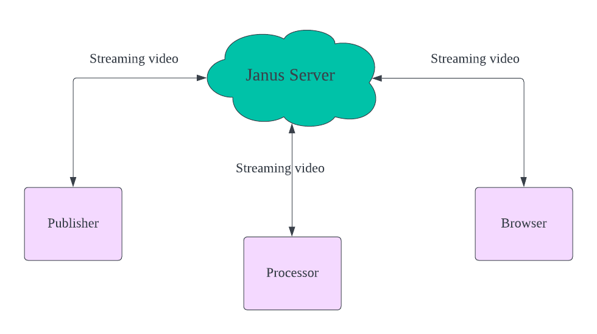
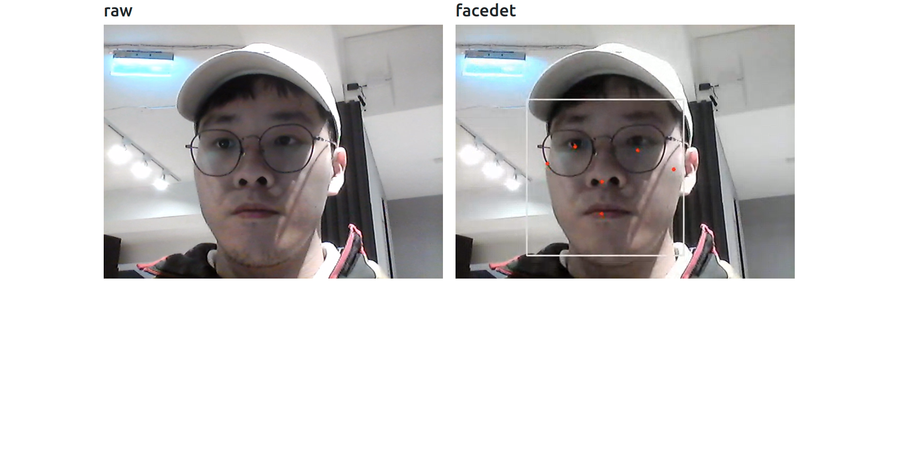

# webrtc with AI processing
In this project, we use webrtc to perform real-time video streaming, and add janus gateway as a media server. With the help of janus server, we can do extra processing on our streaming video, and display the streaming video on the browser.


## Environment
```
- Ubuntu 18.04
- ffmpeg 4.3.2
- Python 3.9
```

## Setup Environment

+ Install Janus webrtc server
```
./install.sh
```

+ Upgrade ffmpeg & libavcodec-dev
```
# Issue: https://github.com/jdgalviss/jetbot-ros2/issues/6#issuecomment-932993554
sudo add-apt-repository ppa:jonathonf/ffmpeg-4
sudo apt update
sudo apt upgrade -y ffmpeg
sudo apt upgrade -y libavcodec-dev
```

+ Install Python packages
```
python3 -m pip install -r requirements.txt
```

## How to run

1. Start the janus webrtc server
```
/opt/janus/bin/janus
```

2. WebRTC media publisher (Stream the webcam video to the janus webrtc server)
```
python3 publisher.py \
    --url http://localhost:8088/janus \
    --room 1234 \
    --name raw \
    --dev /dev/video0
```

3. WebRTC media processor (Fetch the raw streaming video on the janus server and perform AI processing. Then stream the processed video to the janus webrtc server)
```
python3 processor.py \
    --url http://localhost:8088/janus \
    --room 1234 \
    --name facedet
```

4. Display realtime streaming videos on the browser.
```
python3 -m http.server

# Visit http://localhost:8000/
```

## Demo image

